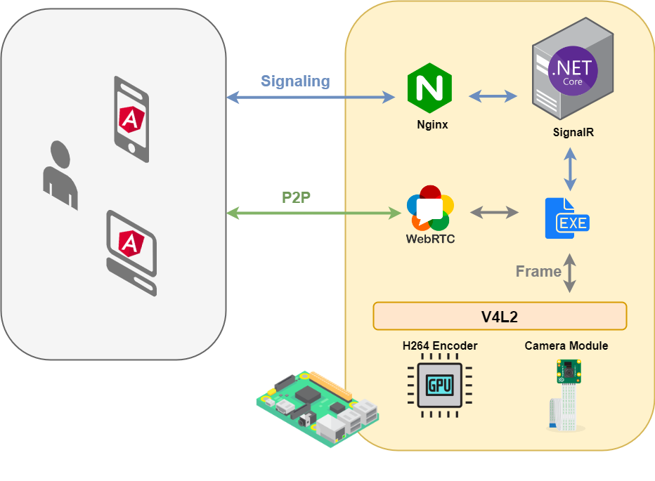
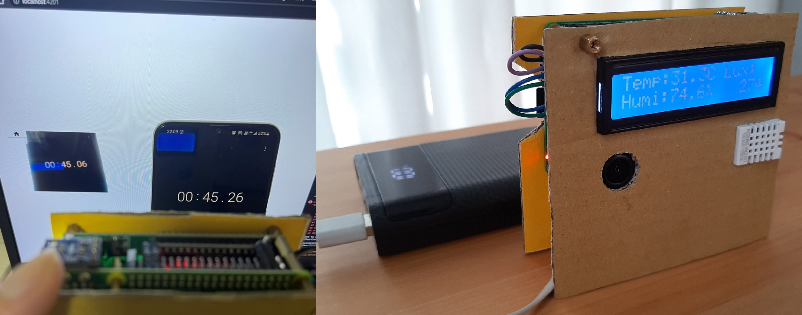
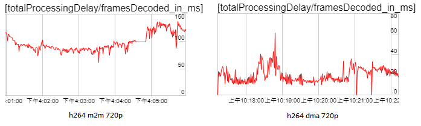

# RaspberryPi_WebRTC
 
Using v4l2_m2m hardware encoder or raw h264 camera with WebRTC reduces the CPU usage compared to built-in VP8 software encoding.

Step of using signalr as the webrtc signaling server

1. [Build the native webrtc](./doc/BUILD_WEBRTC.md) on Ubuntu 20.04 64bit
2. [Build the SignalR-Client](./doc/BUILD_SIGNALR_CLIENT_CPP.md) with boringssl
3. Create .net [signalr server hub](https://github.com/TzuHuanTai/FarmerAPI/blob/master/FarmerAPI/Hubs/SignalingServer.cs)
4. Use signalr-client to exchange ice/sdp information with webrtc.lib.
5. Receive camera frames via `ioctl` and send its to `AdaptedVideoTrackSource`, then `VideoEncoder` encode the frame and callback finish encoding.

## Architecture


## Environment
* RaspberryPi 3B + Raspberry Pi Camera v1.3
* RaspberryPi OS 64bit
* [clang 12+](https://github.com/llvm/llvm-project/releases)
* `boringssl` replace `openssl`

## Summary
* Latency is about 0.2 seconds delay.
* Temperatures up to 60~65°C.
* Using HW DMA sources minimizes CPU usage and latency.

| Codec | Source format | Resolution | FPS | CPU  |  Latency  | Temperature |
| :---: | :-----------: | :--------: | :-: | :--: | :-------: | :---------: |
|  VP8  |     MJPEG     |  1280x720  |  30 | ~60% | 200~250ms |   60~65°C   |
|  VP8  |     MJPEG     |   640x480  |  60 | ~60% | 190~220ms |             |
|  VP8  |     MJPEG     |   320x240  |  60 | ~30% | 120~140ms |             |
|  H264 |     MJPEG     |  1280x720  |  30 | ~35% |   < 200ms |        |
|  H264 |     MJPEG     |   640x480  |  30 | ~25% |   < 150ms |        |
|  H264 |     MJPEG     |   320x240  |  60 | ~25% |   < 100ms |        |
|  H264 |    YUV420     |  1280x720  |  15 | ~20% | 300~350ms |             |
|  H264 |    YUV420     |   640x480  |  15 | ~20% | 200~220ms |             |
|  H264 |    YUV420     |   320x240  |  30 | ~15% | 190~200ms |             |
|  H264 |    **DMA**    |  1280x720  |  30 | ~20% |     ~50ms |             |




<hr>

# How to use
## Preparation
 * Follow [SETUP_ARM64_ENV](./doc/SETUP_ARM64_ENV.md) to prepare an arm64 env for compilation (Optional)
 * Follow [BUILD_WEBRTC](./doc/BUILD_WEBRTC.md) to compile `libwebrtc.a` 
 * Follow [BUILD_SIGNALR_CLIENT_CPP](./doc/BUILD_SIGNALR_CLIENT_CPP.md) to compile `microsoft-signalr`
 * Install the needed packages
    ```bash
    sudo apt install libboost-program-options-dev libavformat-dev libavcodec-dev libavutil-dev libavdevice-dev libswscale-dev
    ```
* Copy the [nlohmann/json.hpp](https://github.com/nlohmann/json/blob/develop/single_include/nlohmann/json.hpp) to `/usr/local/include` 

## Compile and run
```bash
mkdir build
cd ./build
cmake .. -DCMAKE_CXX_COMPILER=/usr/bin/clang++
make -j
./pi_webrtc --device=/dev/video0 --fps=30 --width=1280 --height=720 --signaling_url=http://localhost:6080/SignalingServer --v4l2_format=mjpeg --record_path=/home/pi/video/ --enable_v4l2_dma
```

## Run as Linux Service
1. Set up [PulseAudio](https://wiki.archlinux.org/title/PulseAudio)
*  Modify this line in `/etc/pulse/system.pa`
    ```ini
    load-module module-native-protocol-unix auth-anonymous=1
    ```

* `sudo nano /etc/systemd/system/pulseaudio.service`, config sample:
    ```ini
    [Unit]
    Description= Pulseaudio Daemon
    After=rtkit-daemon.service systemd-udevd.service dbus.service

    [Service]
    Type=simple
    ExecStart=/usr/bin/pulseaudio --system --disallow-exit --disallow-module-loading --log-target=journal
    Restart=always
    RestartSec=10
      
    [Install]
    WantedBy=multi-user.target
    ```
* Enable and run the service
    ```bash
    sudo systemctl enable pulseaudio.service
    sudo systemctl start pulseaudio.service
    ```

2. Set up WebRTC program 
* `sudo nano /etc/systemd/system/webrtc.service`, config sample:
    ```ini
    [Unit]
    Description= the webrtc service need signaling server first
    After=systemd-networkd.service farmer-api.service

    [Service]
    Type=simple
    WorkingDirectory=/home/pi/IoT/RaspberryPi_WebRTC/build
    ExecStart=/home/pi/IoT/RaspberryPi_WebRTC/build/pi_webrtc --fps=30 --width=1280 --height=720 --signaling_url=http://localhost:6080/SignalingServer --v4l2_format=h264 --record_path=/home/pi/video/
    Restart=always
    RestartSec=10
      
    [Install]
    WantedBy=multi-user.target
    ```
* Enable and run the service
    ```bash
    sudo systemctl enable webrtc.service
    sudo systemctl start webrtc.service
    ```

# Install the [coturn](https://github.com/coturn/coturn)
If the cellular network is used, the `coturn` is required because the 5G NAT setting by ISP may block p2p.
1. Install
    ```bash
    sudo apt update
    sudo apt install coturn
    sudo systemctl stop coturn.service
    ```
2. Edit config `sudo nano /etc/turnserver.conf`, uncomment or modify below options
    ```ini
    listening-port=3478
    listening-ip=192.168.x.x
    relay-ip=192.168.x.x
    external-ip=174.127.x.x/192.168.x.x
    #verbose
    lt-cred-mech
    user=webrtc:webrtc
    realm=greenhouse
    no-tls
    no-dtls
    syslog
    no-cli
    ```
3. Set the port `3478` forwarding on the router
4. Start the service, `sudo systemctl start coturn.service`

# Reference
* [Version | WebRTC](https://chromiumdash.appspot.com/branches)
* [Building old revisions | WebRTC](https://chromium.googlesource.com/chromium/src.git/+/HEAD/docs/building_old_revisions.md)
* [Using a custom clang binary | WebRTC](https://chromium.googlesource.com/chromium/src/+/master/docs/clang.md#using-a-custom-clang-binary)
* [Trickle ICE](https://webrtc.github.io/samples/src/content/peerconnection/trickle-ice/)
