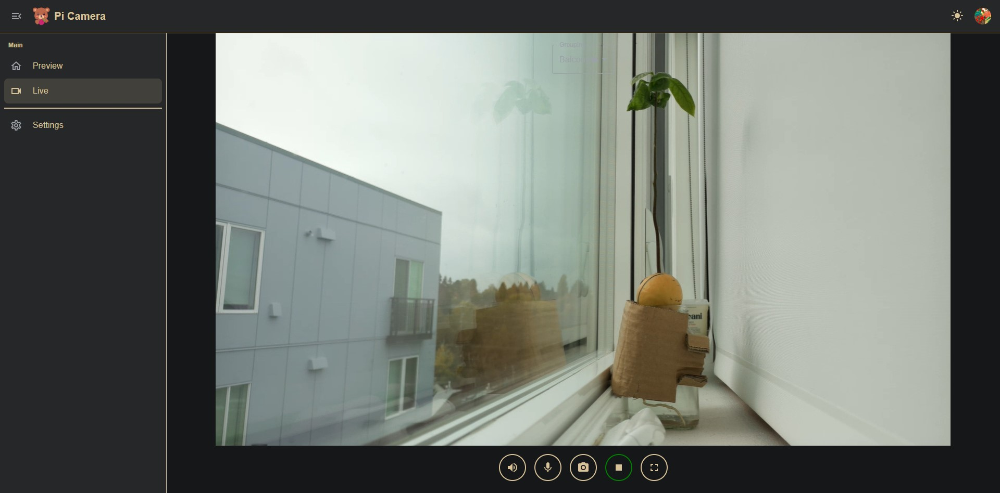

<h1 align="center">
    Raspberry Pi WebRTC
</h1>

<p align="center">
    <a href="https://chromium.googlesource.com/external/webrtc/+/branch-heads/5790"></a>
    
    
    
    <a href="https://opensource.org/licenses/Apache-2.0"></a>
</p>

<p align=center>
    
</p>

Turn your Raspberry Pi into a low-latency home security camera using the V4L2 DMA hardware encoder and WebRTC. [[demo video](https://www.youtube.com/watch?v=JZ5bcSAsXog)]

- Pure P2P-based camera allows video playback and download without a media server.
- Support [multiple users](doc/pi_4b_users_demo.gif) for simultaneous live streaming.

# How to use

To set up the environment, please check out the [tutorial video](https://youtu.be/g5Npb6DsO-0) or the steps below.

* Download and run the binary file from [Releases](https://github.com/TzuHuanTai/RaspberryPi_WebRTC/releases).
* Set up the network configuration and create a new client using one of the following options:
    * [Pi Camera](https://github.com/TzuHuanTai/Pi-Camera) app (Android).
    * [Pi Camera Web](https://picamera.live).

## Hardware Requirements


* Raspberry Pi (Zero 2W/3/3B+/4B/5).
* CSI or USB Camera Module.

## Environment Setup

1. Install Raspberry Pi OS

    Use the [Raspberry Pi Imager](https://www.raspberrypi.com/software/) to install Raspberry Pi Lite OS on your microSD card.
> [!TIP]
> **Can I use a regular Raspberry Pi OS, or does it have to be Lite?**<br/>
> You can use either the Lite or full Raspberry Pi OS (the official recommended versions), but Lite OS is generally more efficient.

2. Install essential libraries
    ```bash
    sudo apt install libmosquitto1 pulseaudio libavformat59 libswscale6
    ```
3. Download and unzip the binary file
    ```bash
    wget https://github.com/TzuHuanTai/RaspberryPi_WebRTC/releases/download/v1.0.2/pi_webrtc-1.0.2_pi-os-bookworm.tar.gz
    tar -xzf pi_webrtc-1.0.2_pi-os-bookworm.tar.gz
    ```

## Running the Application

### MQTT Setup

An MQTT server is required for communication between devices. For remote access, free cloud options include [HiveMQ](https://www.hivemq.com) and [EMQX](https://www.emqx.com/en).

> [!TIP]
> **Is MQTT registration necessary, and why is MQTT needed?**<br/>
> Yes, MQTT is required for signaling P2P connection info between your camera and the client UI.
If you choose to self-host an MQTT server (e.g., [Mosquitto](doc/SETUP_MOSQUITTO.md)) and need to access the signaling server remotely via mobile data, you may need to set up DDNS, port forwarding, and SSL/TLS.

### Start the Application

* Set up the MQTT settings on your [Pi Camera App](https://github.com/TzuHuanTai/Pi-Camera) or [Pi Camera Web](https://picamera.live), and create a new device in the settings to get a `UID`. 
* Run the command based on your network settings and `UID`:
    ```bash
    ./pi_webrtc --use_libcamera --fps=30 --width=1280 --height=960 --hw_accel --no_audio --mqtt_host=your.mqtt.cloud --mqtt_port=8883 --mqtt_username=hakunamatata --mqtt_password=Wonderful --uid=your-custom-uid
    ```

> [!IMPORTANT]
> For Raspberry Pi 5 or other SBCs without hardware encoding support, run this command in software encoding mode by removing the `--hw_accel` flag.
* Go to the Live page to enjoy real-time streaming!

<p align=center>
    
</p>

# Advance

For recording video, two-way communication, or running as a background service, please refer to the [wiki page](https://github.com/TzuHuanTai/RaspberryPi_WebRTC/wiki/Advanced-Settings).

# License

This project is licensed under the Apache License, Version 2.0. See the [LICENSE](LICENSE) file for details.

```
Copyright 2022 Tzu Huan Tai (Author)

Licensed under the Apache License, Version 2.0 (the "License");
you may not use this file except in compliance with the License.
You may obtain a copy of the License at

    http://www.apache.org/licenses/LICENSE-2.0

Unless required by applicable law or agreed to in writing, software
distributed under the License is distributed on an "AS IS" BASIS,
WITHOUT WARRANTIES OR CONDITIONS OF ANY KIND, either express or implied.
See the License for the specific language governing permissions and
limitations under the License.
```
